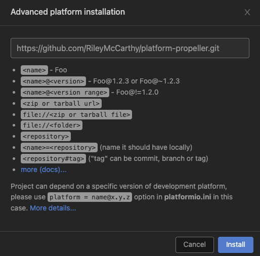

# PlatformIO for the Parallax Propeller

PlatformIO platform to add support for the parallax 2. Using the Flexprop toolchain we can compile binaries and upload them using load-p2.

## Installation (GUI)

Must have GIT installed for platformio to properly download this platforms repository (https://git-scm.com/downloads)

Navigate to PIO Home -> Platforms -> Advanced Installation

Enter the GitHub URL

```
https://github.com/RileyMcCarthy/platform-propeller.git#6.2.3
```



## Installation (CLI)

```
pio pkg install --platform https://github.com/RileyMcCarthy/platform-propeller.git
```

## Packages

https://github.com/RileyMcCarthy/toolchain-flexprop

https://github.com/RileyMcCarthy/tool-loadp2
